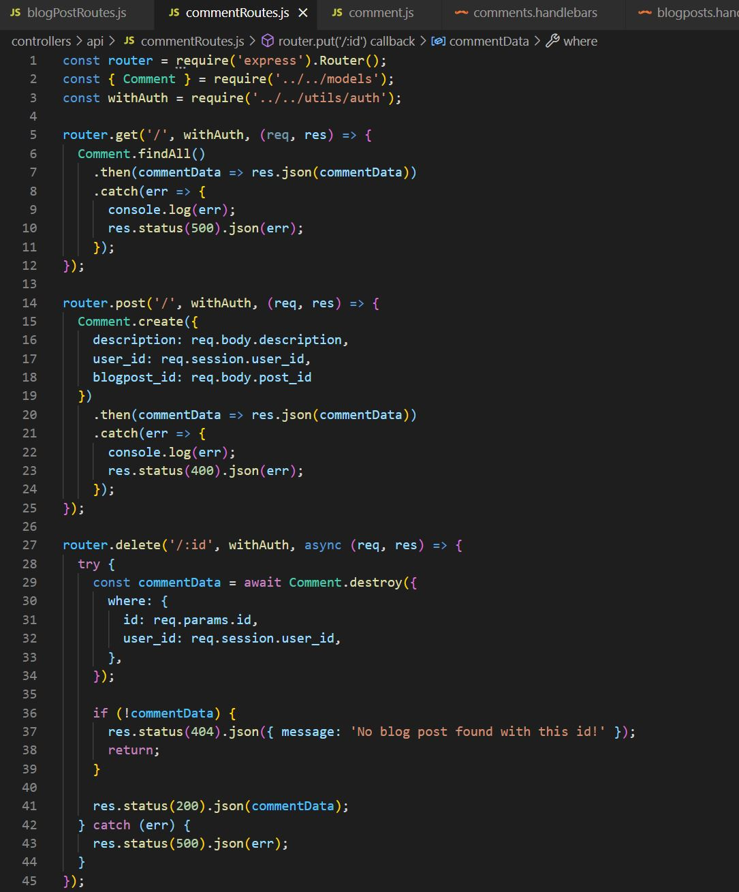
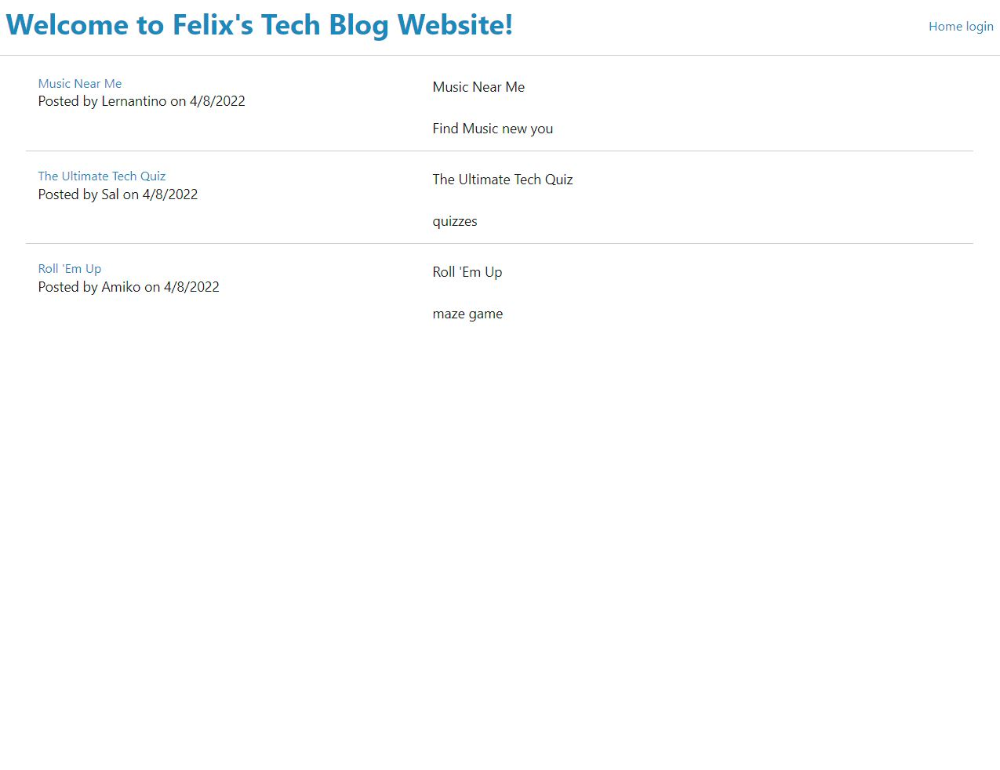
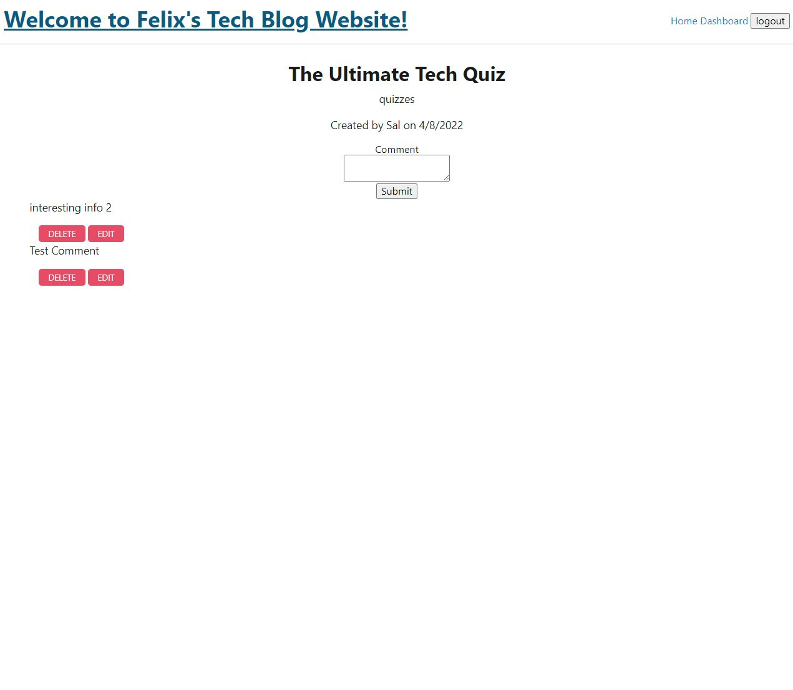

# Felixs-MVC-Blog-Website

## Description

This application was designed to funcion as a blog posting website. The user accesses a local server that is launched and then allows for creating and editing blog posts. Once a post has been created, a user can then add, modify or delete individual comments on an individual post. A user authentication portal allows individual users to create a login profile which then adds the above functionality. 

## Table of Contents

- [Description](#description)

- [Installation](#installation)

- [Usage](#usage)

- [Contributors](#contributors)

- [Technology](#technology)

- [Links](#links)

## Installation

The application can be ran by performing an npm installation using the "npm i" command. Following the installation, the "npm start" command or "nodemon" command can be used to launch the API server which will then allow a user to launch the website and complete inputs through the individual handlebar-generated html pages after launching http://localhost:3001. 

## Usage

This application can be used to easily view, create, modify or delete specific blog posts generated dynamically through multiple handlebar-generated webpages. The user can create a user account, which then allows them to create a blogpost and edit it. Once a post has been created, a further portal exists which then allows the user to add comments, along with modifying and deleting them for a specific blog post. 

Usage and Code Examples:

## Contributors

[Felix Petzsche GitHub Link](https://github.com/felix1805).

## Technology

This application uses javascript, JEST, HTML, node.js, express routing, mysql2, node package management and inquirer. Handlebars is used to then dynamically create and modify each webpage that is viewed and altered by the inidvidual users. It should be viewed by launching a live server using nodemon and then accessing the page from http://localhost:3001

## Links

[MVC Blog Website](https://felix1805.github.io/Felixs-MVC-Blog-Website/).
[Heroku Web Link](https://thawing-hollows-75703.herokuapp.com/).
